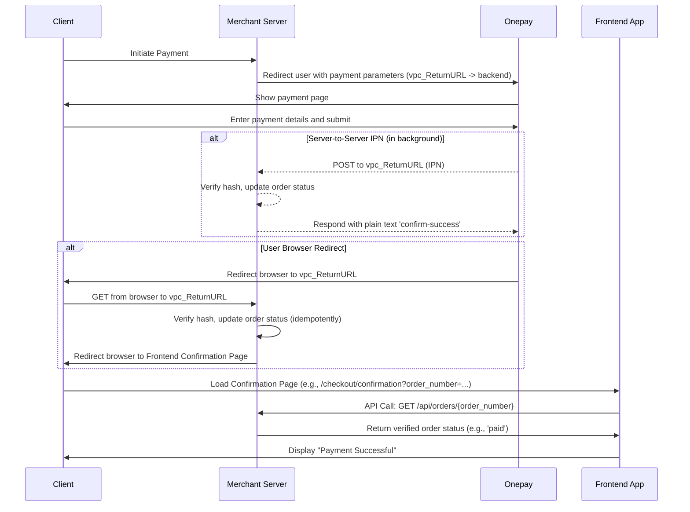
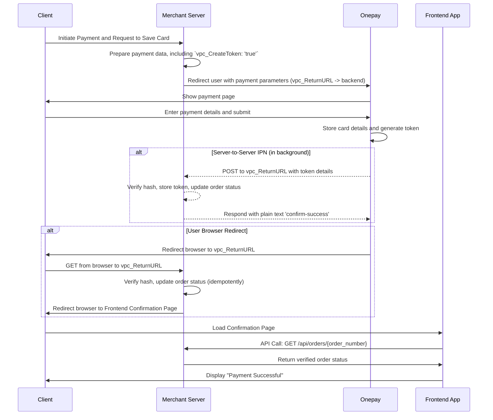
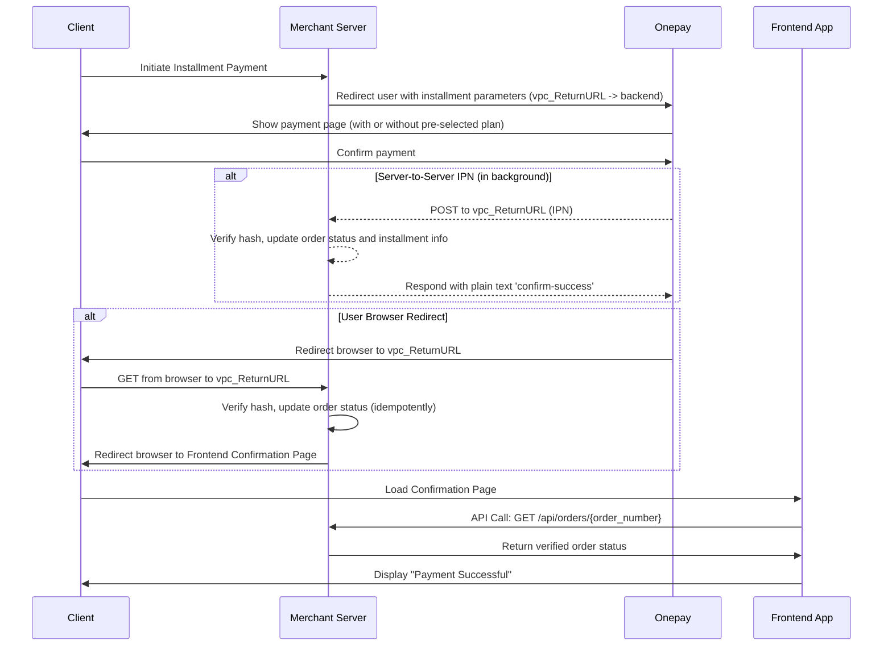
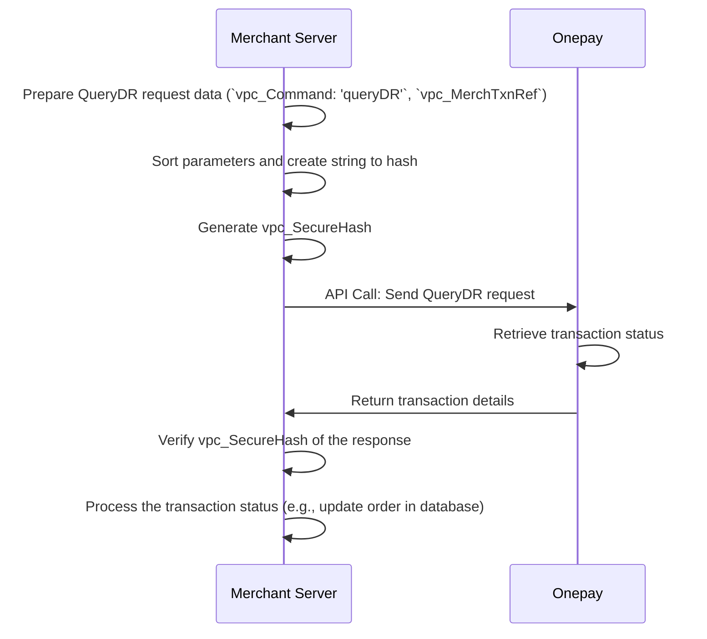
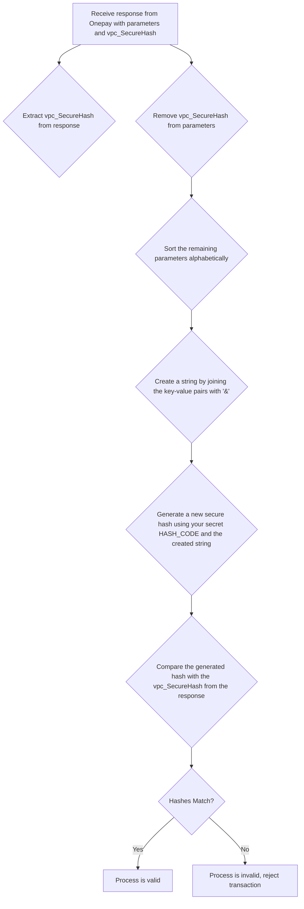

### 1. Standard Payment Flow (Updated)

This diagram now shows how the backend handles both the server-to-server notification and the user's browser redirect from the same `vpc_ReturnURL`.

### 2. Payment with Token Creation (Updated)

The callback and confirmation flow is the same, following the new, more detailed pattern.

### 3. Installment Payment (Updated)

This flow also now correctly shows the final confirmation process. This example covers both installment selection methods (at Onepay or at the merchant site), as the confirmation flow is identical.

### 4. Query Transaction (QueryDR)

This flow allows the merchant to check the status of a transaction.

### 5. Verify Secure Hash

This is a critical step that happens whenever the merchant server receives a response from Onepay. It ensures the data has not been tampered with.

